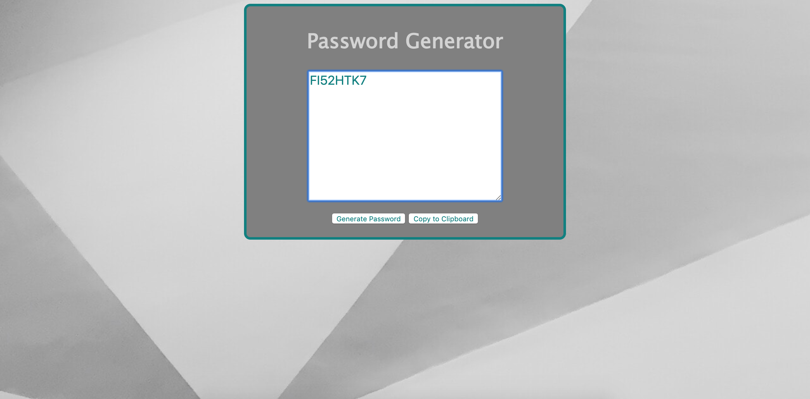

# Password Generator

The purpose of this application is to generate a random password based on criteria selected by the user. The application prompts the user to select a password length between 8 and 128 characters, and whether or not the password will include special, lowercase, uppercase, and/or numeric characters.

As the user selects criteria for the password, a string is created of those characters. The function selectChar() selects random characters from this string. The function generatePassword() concatenates these characters into a new string of designated length called password.

Once the user completes all of the prompts, the generatePassword() function is automatically called. When the user clicks on the Generate Password button, an event listener writes the password to the page by assigning the textContent of the element to the password.

Additionally, the user may click the Copy to Clipboard button. A new element will be created and addended to the page which contains the password. The password is selected and copied to the clipboard using execCommand('copy').

;

<a href = "">